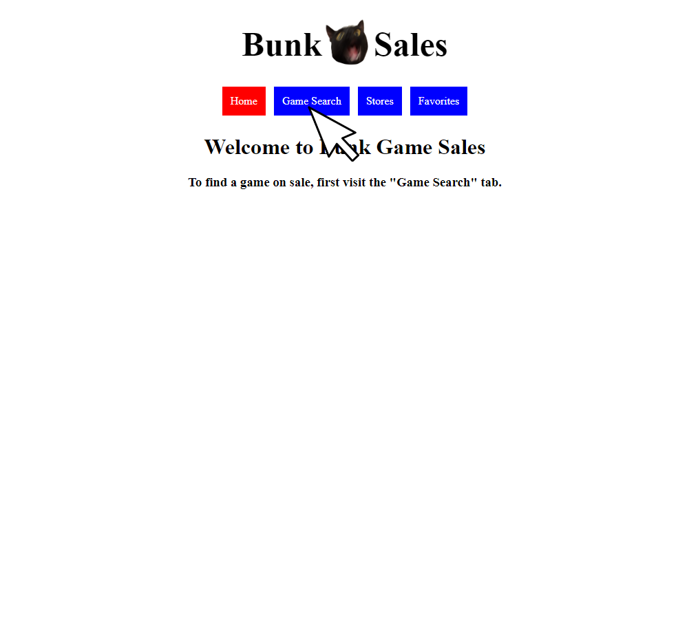

# Bunk Sales

Bunk Sales is a web search application that can be used to find the best price for any given PC game, given that there are active deals happening.

Additionally, the application can also be used to find all deals for a given online marketplace, as well as to save a user's favorites games to a "favorites" database.

## Installation

- In order to install the application, please ```fork``` and ```clone``` this repository to your local device.

- In order to start the application, please make sure you are in the project directory, then run ```npm start```.

- If an error is encountered running ```npm start```, please run ```npm install``` to install the required dependencies, then try running ```npm start``` once more.

- To make sure that the Favorites page of the application works, you must fork and clone the [database repository](https://github.com/ZachatorCodes/phase-2-project-server), and then start a json-server with the ```db.json``` file. Further instructions for installing the database can be found in the README file of the [database repository](https://github.com/ZachatorCodes/phase-2-project-server).

## Usage

- To use Bunk Sales, please make sure the application is open and running. To search for a specific game, please click on the "Game Search" tab of the navigation bar.



- Once you are on the "Game Search" page, to search for a game, enter a game name into the search bar visible on the page. To submit the game search, either click the "Search" button, or go ahead and hit the [ENTER] key.

- Once you have submitted your search, results should be able to be seen on the left side of the page. If no results are visible, make sure that the game's name is spelled correctly. Otherwise, the game might not be included in the fetch's API.

- Each game card should have a button attached to it, opening up more information about the selected game, including the cheapest ever price it has been sold for. If there are any active deals, they will show up below this extra game information. If no deals are visible, there are currently no sales going on for the selected game.


- To see deals for a specific storefront, please click on the "Stores" tab of the navigation bar.


- If you'd like to sort the stores by alphabetical order, you can do so by checking the "Sort Alphabetically" box at the top of the page.

- To see deals from a specific store, click the "See Deals" button at the bottom of a specific store card.

- When clicked, the 60 most popular deals for the selected marketplace will be shown on the right side of the screen. If there are no deals visible, it means that the selected store has no deals active.


- Finally, to add games to the favorites database, please click on the "Favorites" tab of the navigation bar.


- In order to add a new game to the database, please fill out the form with your favorite game's name and image URL. Then, click the "Add Game" button.


## API

This application was created using the [CheapShark Deals API](https://apidocs.cheapshark.com/). As requested by the API creator, all redirects to specific deals are done so through CheapShark's specific redirect URL. Many thanks to CheapShark for creating such a helpful API!